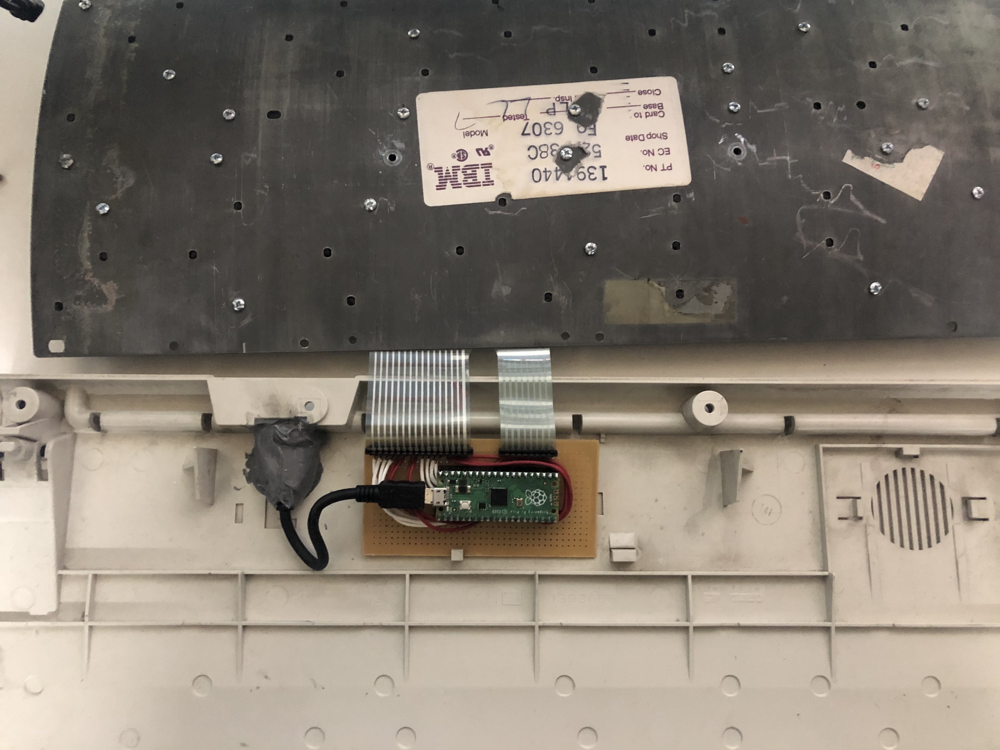
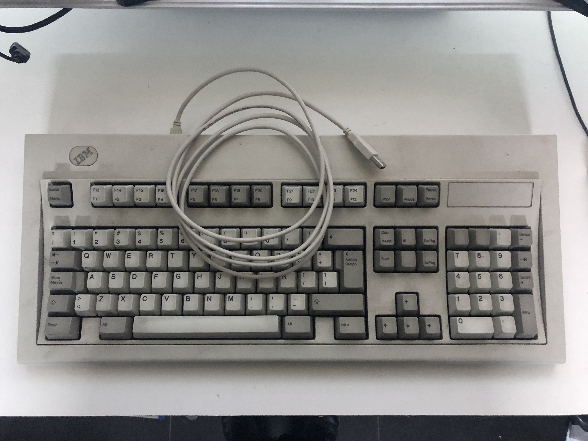

# IBM-Model-M

Este proyecto es para reciclar un teclado IBM Model M de una terminal antigua (con conector RJ45), usando una Raspberry Pi Pico con un firmware KMK.

Para empezar ir [KMK](https://github.com/KMKfw/kmk_firmware/blob/master/docs/en/Getting_Started.md)

Con ayuda de este diagrama pude hacer la matriz.

Mapeando con esta [referencia](https://github.com/KMKfw/kmk_firmware/blob/master/docs/en/keycodes.md) de KMK.

El interior quedó así:

Y el resultado, un IBM Model M USB

